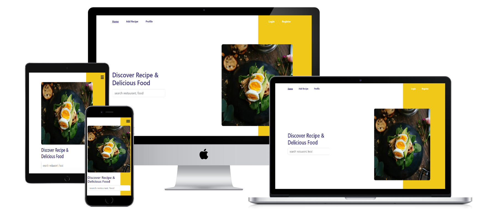

<br>

# Website Pijar Food
The Pijar Food FE is a tutorial application for creating various types of food, combined with video tutorials and written ingredients. This application uses the PostgreSQL database, Express JS for backend development, and utilizes the React JS library and Bootstrap 5 for frontend development.

## Instal
The Food Recipe website can run locally on your machine. Please download this repository and open it using Visual Studio Code. Then, execute the following commands in the terminal.
```sh
cd food-recipe-fe-react
npm i
npm start
```

## Fitures Website Pijar Food
- Various cooking tutorials
- Equipped with video tutorials
- Responsive website for both desktop and mobile devices
- Recipe search functionality
- Add recipe page
- Recipe page

## Tech
- [Bootstrap](https://getbootstrap.com/) - A CSS framework is a collection of HTML, CSS, and JavaScript templates that enable the rapid and easy creation of responsive websites.
- [HTML] - Hypertext Markup Language (HTML) is the standard markup language for creating and structuring web pages and applications.
- [CSS] - Cascading Style Sheets (CSS) is used to control the appearance of elements written in the markup language.
- [Google Chrome](https://www.google.com/chrome) - Google Chrome is a software that functions to search, access, and display various forms of information.
- [JavaScript] - Programming languages used in website development to make them more dynamic and interactive.
- [Sweetalert2](https://sweetalert2.github.io/) - JavaScript library that provides various options for creating different types of popup alerts such as regular alerts, error alerts, success alerts, confirmation alerts, and so on.
- [React JS](https://legacy.reactjs.org/) -  JavaScript library used in the development process of dynamic web applications.

## Screenshots
<table>
 <tr>
    <td></td>
  </tr>
  <tr>
    <td>Login</td>
  </tr>
 <tr>
  <td></td>
 </tr>
  <tr>
    <td>Register</td>
  </tr>
 <tr>
  <td> </td>
 </tr>
  <tr>
   <td>Home</td>
  </tr>
  <tr>
  <td> </td>
 </tr>
  <tr>
   <td>Search Recipe</td>
  </tr>
 <tr>
  <tr>
    <td> </td>
  </tr>
   <tr>
    <td>Add Recipe</td>
  </tr>
  <tr>
   <td> </td>
 </tr>
 <tr>
     <td>Detail</td>
  </tr>
 <tr>
   <td> </td>
 </tr>
 <tr>
     <td>Profile</td>
  </tr>
  <tr>
   <td> </td>
 </tr>
 <tr>
     <td>Edit Profile</td>
  </tr>
</table>

## Related Project

- [`Frontend Pijar Food`](https://github.com/MuhammadSonySetiawan/pijar-food-react)

- [`Backend Pijar Food`](https://github.com/MuhammadSonySetiawan/pijar-food-be)

- [`Demo Pijar Food`](https://pijar-food-website.vercel.app/)
