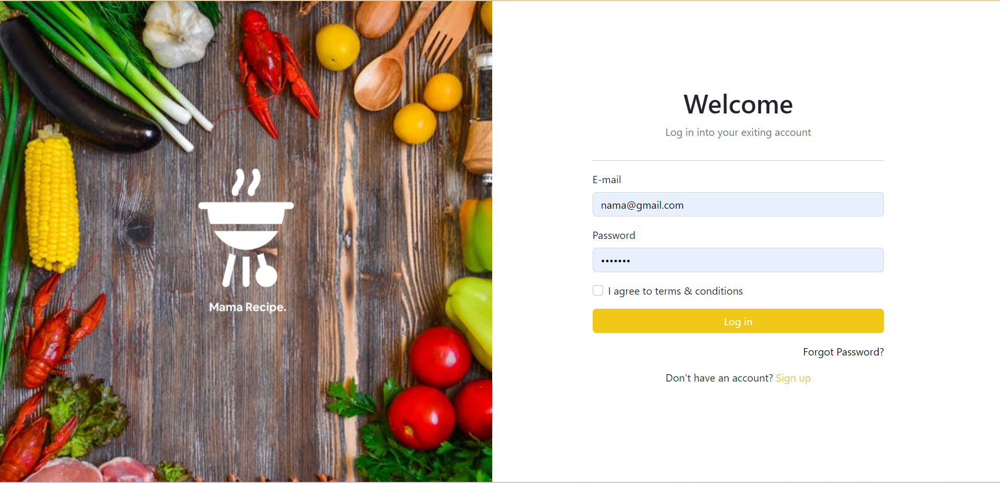

<br>

# Aplikasi Pijar Food FE
Aplikasi Pijar food FE adalah aplikasi tutorial pembuatan berbagai macam makanan di padu dengan video tutorial dan bahan-bahan yang telah ditulis. Aplikasi ini menggunakan database postgresQL, Express JS untuk pembuatan backend dan menggunakan library React js, bootstrap 5 untuk pembuatannya frontend.

## Instal
Situs Resep Makanan dapat berjalan di lokal Anda, unduh repo ini dan buka menggunakan kode studio visual, dan jalankan terminal seperti di bawah ini.
```sh
cd food-recipe-fe-react
npm i
npm start
```

## Fitures Aplikasi Pijar Food FE
- Tutorial berbagai masakan
- Di bekali juga dengan video turtorial
- Responsive website dan mobile
- Pencarian untuk resep
- halaman tambah resep
- halaman resep

## Tech
- [Bootstrap](https://getbootstrap.com/) - Framework CSS yang di dalamnya berisi template HTML, CSS, dan JavaScript yang untuk membuat sebuah website yang responsif dengan cepat dan mudah
- [HTML] - Hypertext Markup Language, yaitu bahasa markup standar untuk membuat dan menyusun halaman dan aplikasi web
- [CSS] - Cascading Style Sheet yaitu digunakan untuk mengatur tampilan elemen yang tertulis dalam bahasa markup
- [Google Chrome](https://www.google.com/chrome) - Google Chrome merupakan perangkat lunak yang memiliki fungsi untuk mencari, mengakses, dan menampilkan segala bentuk informasi
- [JavaScript] - pemrograman yang digunakan dalam pengembangan website agar lebih dinamis dan interaktif
- [Sweetalert2](https://sweetalert2.github.io/) - library JavaScript yang menyediakan berbagai pilihan bagi kita untuk membuat berbagai jenis pop-up alert seperti alert biasa, alert error, alert success, alert konfirmasi, dan sebagainya.
- [React JS](https://legacy.reactjs.org/) -  library JavaScript yang digunakan dalam proses pengembangan aplikasi web dinamis.

## Screenshots
<table>
 <tr>
    <td></td>
  </tr>
  <tr>
    <td>Login</td>
  </tr>
 <tr>
  <td></td>
 </tr>
  <tr>
    <td>Register</td>
  </tr>
 <tr>
  <td> </td>
 </tr>
  <tr>
   <td>Home</td>
  </tr>
  <tr>
    <td> </td>
  </tr>
   <tr>
    <td>Add Recipe</td>
  </tr>
 <tr>
   <td> </td>
 </tr>
 <tr>
     <td>Profile</td>
  </tr>
</table>

## Related Project

- [`Frontend Recipe Food`](https://github.com/MuhammadSonySetiawan/pijar-food-react)

- [`Backend Recipe Food`](https://github.com/MuhammadSonySetiawan/pijar-food-be)

- [`Demo Recipe Food`](https://pijar-food-react-nine.vercel.app/)
